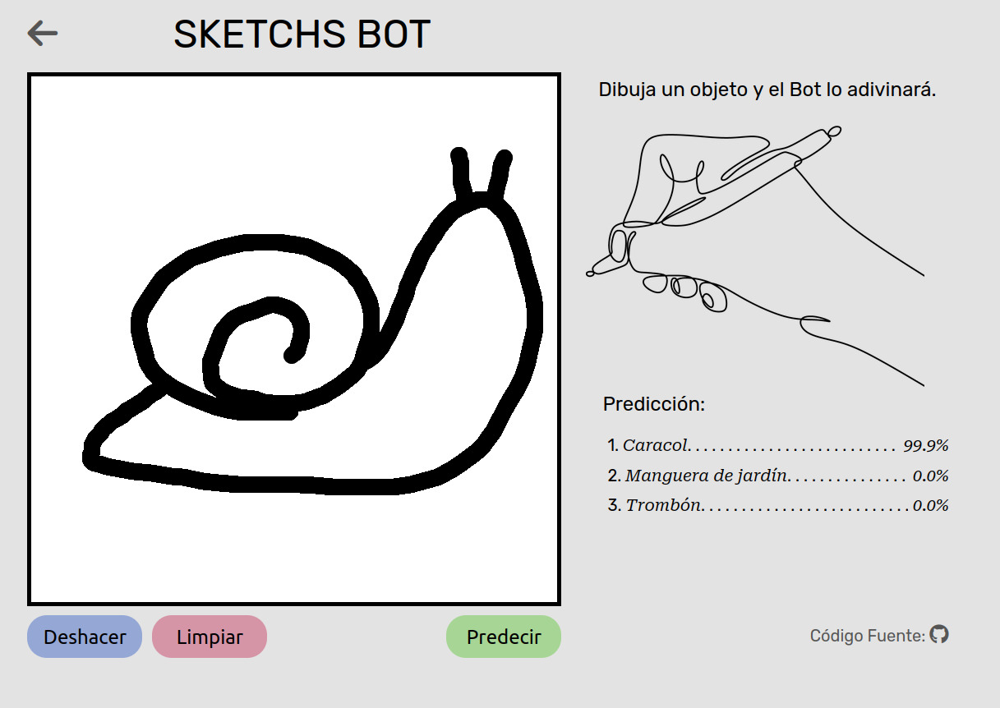
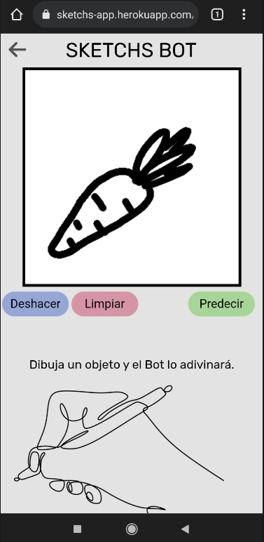
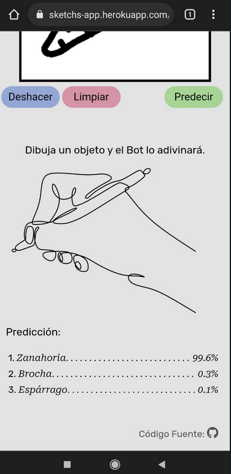

# Sketchs Bot App

A web app with a Bot included which can guess the objects that a user hand-draws. There are 340
categories.

It was built using Flask, TensorFlow and OpenCV. And deployed in Heroku
cloud [here](http://sketchs-app.herokuapp.com).

## Requirements

The project was developed in a Python 3.9 environment using the following libraries:

1. [Flask](https://flask.palletsprojects.com/en/2.0.x/)
2. [NumPy](https://numpy.org/)
3. [OpenCV](https://docs.opencv.org/3.4/d6/d00/tutorial_py_root.html)
4. [Pandas](https://pandas.pydata.org/)
5. [TensorFlow](https://www.tensorflow.org)

One can run the program locally by first installing the dependencies executing

```
pip install -r requirements.txt
```

on terminal. Then exporting the application with

```
export FLASK_APP=application
```

And finally running the web page writing

```
flask run
```

## Methodology

The page was written in HTML and CSS. For the canvas widget (the drawing box) we used Javascript.
And Python for the user's hand-draw recievement.

The image is recieved in the base64 format, and converted into a NumPy array using OpenCV, to be
embedded into a TensorFlow's *MobileNet* classifier for get the predictions.

The classifier was trained with
the [Quick Draw Doodle Recognition Dataset](https://www.kaggle.com/c/quickdraw-doodle-recognition)
from Kaggle.

### Dataset

We downloaded the `train_simplified` data folder, which contains millions of hand-drawn images
occupying 24GB of memory. Also divided into 340 categories.

## Examples

Example 1 (On PC):



Example 2 (On Phone):




## Support

Give a :star: if you like it :hugs:.